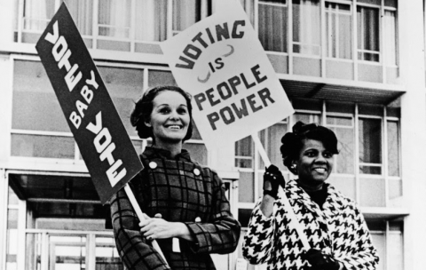

# Applied Data Science @ Columbia
## Spring 2021
## Project 1: A "data story" on how Americans vote



### [Project Description](doc/)
This is the first and only *individual* (as opposed to *team*) this semester. 

Term: Spring 2021

+ Projec title: Voting Pattern of Women in United States
+ This project is conducted by Feng Rong

+ Project summary: It has been more than a century since women were granted the right to vote in 1919, and women has been playing an important role in political affairs. The following data story focuses on the voting pattern of women from 1948 to 2016, supported by the time series study data of ANES.

Following [suggestions](http://nicercode.github.io/blog/2013-04-05-projects/) by [RICH FITZJOHN](http://nicercode.github.io/about/#Team) (@richfitz). This folder is orgarnized as follows.

```
proj/
├── lib/
├── data/
├── doc/
├── figs/
└── output/
```

Please see each subfolder for a README file.
